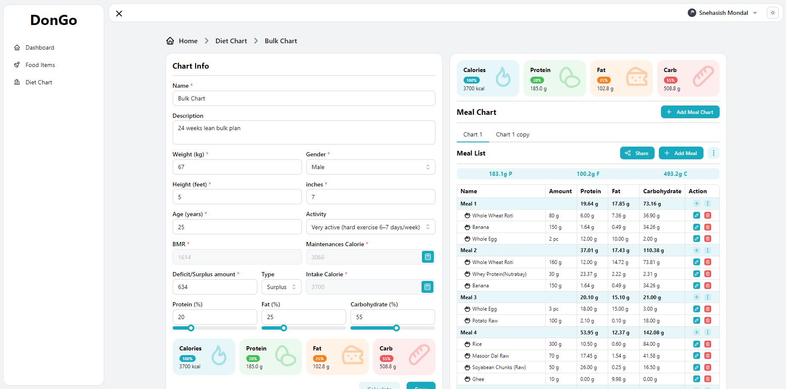

# Diet on the Go Documentation

## Introduction

Diet on the Go is an application designed to help users create personalized diet plans based on their body type and fitness goals. With this application, users can calculate their Basal Metabolic Rate (BMR) and maintenance calories, set dietary goals, and track their macronutrient intake. This documentation provides an overview of the application's functionalities and technologies used.

## How It Works

### 1. **Basic Data Input**

- Users provide their weight (in kg), height (in feet and inches), and age.

### 2. **Calculating BMR**

- BMR (Basal Metabolic Rate) is calculated using the **Harris-Benedict formula**.
\[ BMR = 88.362 + (13.397 \times \text{{weight in kg}}) + (4.799 \times \text{{height in cm}}) - (5.677 \times \text{{age in years}}) \]
  
### 3. **Determining Maintenance Calories**

- Maintenance calories are calculated based on the user's activity level, using the Physical Activity Level (PAL) factors.

| Activity Level          | PAL Value |
|-------------------------|-----------|
| Sedentary               | 1.2       |
| Lightly active          | 1.375     |
| Moderately active       | 1.55      |
| Active                  | 1.725     |
| Very active             | 1.9       |

\[ \text{{Maintenance Calories}} = \text{{BMR}} \times \text{{PAL Value}} \]

### 4. **Setting Caloric Goals**

- Users can choose to create a calorie deficit or surplus based on their goals.

### 5. **Macronutrient Division**

- Users can select the percentage division for macronutrients: protein, fat, and carbohydrates.
- Caloric values for macronutrients: 1g carb = 4 calories, 1g protein = 4 calories, 1g fat = 9 calories.

### 6. **Adding Food Items**

- Users can add food items to their diet plan, each with its own macronutrient division.
- Total macronutrient intake is calculated and displayed to the user.

## Technologies Used

- **Frontend**: React.js, Mantine UI
- **Database**: Firebase Firestore
- **Authentication**: Firebase OAuth
- **Hosting**: Vercel

## Firebase Configuration

The application uses Firebase Firestore for data storage and Firebase OAuth for user authentication. The Firebase configuration is stored in the `firebase.ts` file.

```typescript
...

const firebaseConfig = {
    apiKey: "YOUR_API_KEY",
    authDomain: "YOUR_AUTH_DOMAIN",
    projectId: "YOUR_PROJECT_ID",
    storageBucket: "YOUR_STORAGE_BUCKET",
    messagingSenderId: "YOUR_MESSAGING_SENDER_ID",
    appId: "YOUR_APP_ID",
};

...

```

Replace the placeholders (`YOUR_API_KEY`, `YOUR_AUTH_DOMAIN`, etc.) with your actual Firebase project credentials.

## Preview



Live link https://dotheg.vercel.app/

---

This documentation provides an overview of the Diet on the Go application, explaining its functionalities and the technologies used. If you need further assistance or have specific questions, feel free to reach out.